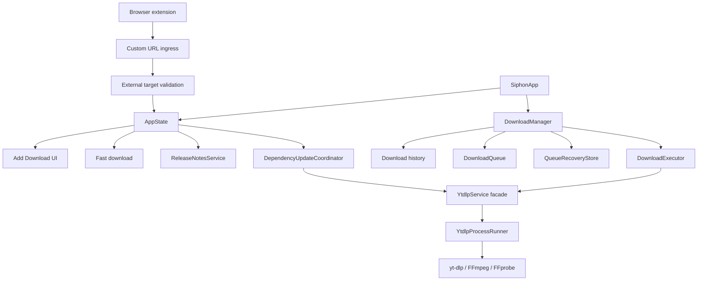

# Siphon Architecture

This document records the runtime ownership boundaries and lifecycle guarantees that are easy to break accidentally in a downloader. It is intentionally narrower than a full code tour.

## Runtime ownership



### Application state

`AppState` owns application-level presentation state and coordination for release notes and dependency updates. Views and app commands observe that state directly.

`DownloadManager` owns download history, queue admission, durable queue recovery, download lifecycle, and the executor. It does not own release-note or dependency-update presentation state.

### Execution ownership

`DownloadExecutor` is the only writer of active task and process-controller ownership. `DownloadManager` exposes read-only execution state and counts rather than task handles.

Stopping or pausing a download requests cancellation. It does not mean the underlying task or process has finished. Executor ownership remains active until `executeDownload` unwinds and its cleanup runs.

The normal cleanup path releases the queue slot, removes task/controller ownership, releases the reserved output path, cleans owned temporary files when appropriate, and notifies the manager that execution finished.

### Durable queue recovery

`QueueRecoveryStore` persists active jobs (`.queued`, `.fetching`, `.downloading`, `.processing`) atomically whenever download state, queue order, or job membership changes.

- Active job metadata (URLs, titles, options, progress, scratch directory paths) is encoded and written atomically to `Application Support/Siphon/queue_recovery.json`. Raw cookies, raw user agents, and arbitrary extra arguments are redacted; the validated non-secret browser-source identifier is retained so protected-site recovery does not silently switch browser profiles.
- Scratch paths are accepted only when they point to Siphon-owned `siphon_scratch_*` directories directly under the process temporary directory. Cleanup refuses any unowned path.
- Paused-job history stores the validated scratch path so pause → quit → reopen → resume can continue partial work across a clean restart.
- Terminal shutdown (`DownloadManager.shutdown()`) records `isCleanShutdown = true`, preventing false-positive recovery prompts across clean application exits.
- If the application process terminates abruptly (crash, SIGKILL, power loss), the uncompleted snapshot remains marked as interrupted. On subsequent launch, `DownloadManager.initialize(...)` detects the interrupted jobs and prompts the user in `ContentView` to restore them back to `.queued` state (preserving per-job scratch directories) or discard them cleanly.

### Dependency update exclusion

yt-dlp replacement is serialized against download execution:

- an update request is rejected while `DownloadManager.activeExecutionCount` is non-zero;
- `DownloadManager.processQueue()` does not admit new work while `YtdlpService.isUpdating` is true;
- queued work is reconsidered when the dependency update finishes.

This prevents a binary replacement from racing with executor-owned work while still allowing downloads submitted during an update to remain queued.

### Terminal shutdown

`DownloadManager.shutdown()` is terminal for that manager instance. It disables future queue admission before requesting executor cancellation and clearing queue reservations.

Executor task/controller ownership is still released by executor teardown rather than being eagerly deleted by the manager. The terminal queue gate is what makes reservation clearing safe during application shutdown.

### External URL ingress

Browser extensions enter through `SiphonApp.handleIncomingURL`. The custom URL is accepted only for supported Siphon schemes and download hosts, then the target URL is validated by `ExternalDownloadTargetPolicy` before it reaches download code.

Raw cookies are never accepted through the custom URL. Browser source identifiers and user agents are sanitized, browser-session state is scoped to the validated target origin, and that state is consumed before the fast-download path reaches `DownloadManager`.

## YtdlpService boundary

`YtdlpService` remains the public facade for extraction, site-specific handling, dependency paths, and download orchestration. Splitting its site/runtime responsibilities is deliberately postponed; callers should continue to depend on the facade rather than reaching into implementation details.

## Validation

The canonical macOS test command is:

```bash
xcodebuild test \
  -project Siphon.xcodeproj \
  -scheme Siphon \
  -destination 'platform=macOS' \
  -configuration Debug \
  MACOSX_DEPLOYMENT_TARGET=15.0 \
  CODE_SIGN_IDENTITY="" \
  CODE_SIGNING_REQUIRED=NO \
  CODE_SIGNING_ALLOWED=NO
```
